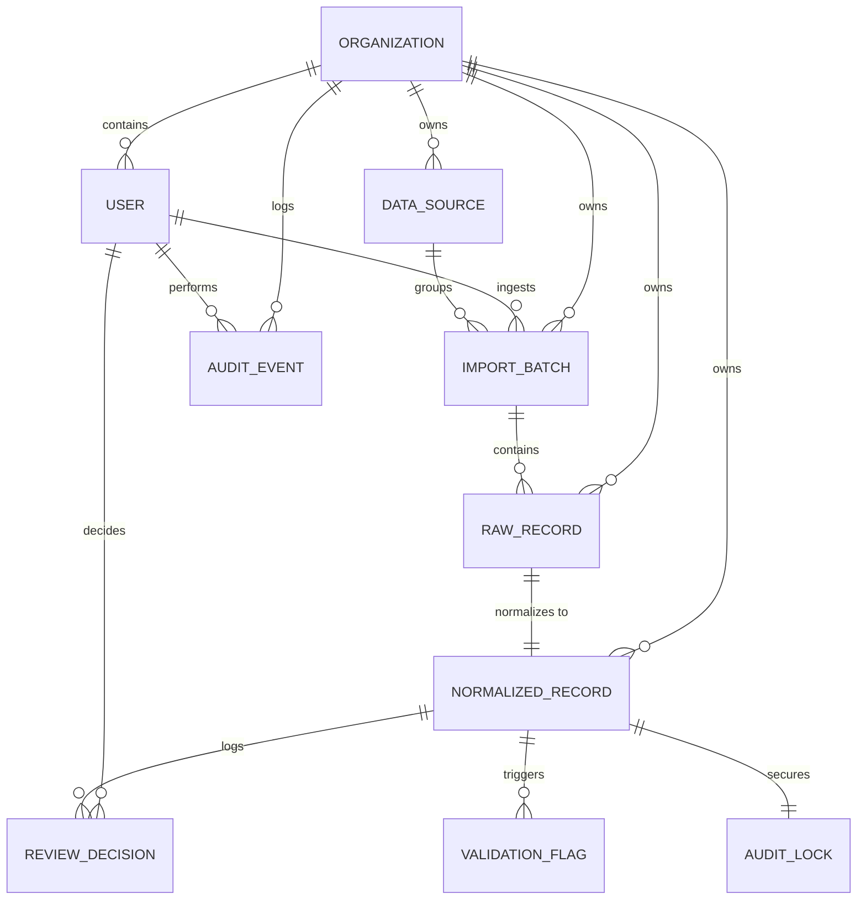

# Data Model Design (MODEL.md)

This document describes the architectural data model designed for the multi-tenant ESG Ingestion & Normalization Platform. The system is built on Django and PostgreSQL, enforcing isolation, data integrity, and a strict, immutable audit trail.

---

## 1. Entity Relationship Overview

The data schema is divided into four logical layers:
1. **Tenancy Layer**: Organization and User management.
2. **Ingestion Layer**: Raw file/API metadata and immutable raw payloads.
3. **Pipeline Layer**: Validation flags, normalized metrics, and calculation logs.
4. **Audit & Review Layer**: Review decisions, lock states, and immutable system audit logs.

---

## 2. Model Schemas & Specifications

All primary keys use auto-generated **UUID4** identifiers rather than sequential integers to prevent resource enumeration attacks and simplify potential multi-region DB merges.

### 2.1 Tenancy Layer

#### `tenancy.Organization`
*Represents a corporate tenant.*
* `id` (UUID, PK)
* `name` (VARCHAR)
* `slug` (SLUG, Unique) — used for tenant identification
* `is_active` (BOOLEAN, default: True)
* `created_at` (DATETIME)

#### `tenancy.User`
*Custom Django auth model inheriting AbstractUser.*
* `id` (UUID, PK)
* `organization` (FK -> Organization, Protect, Nullable for system admins)
* `role` (VARCHAR: `admin`, `analyst`, `reviewer`)
* `email` (VARCHAR)

### 2.2 Ingestion Layer

#### `ingestion.DataSource`
*Represents a configured data intake channel.*
* `id` (UUID, PK)
* `organization` (FK -> Organization, Cascade)
* `source_type` (VARCHAR: `sap_procurement`, `utility_electricity`, `corporate_travel`)
* `scope_category` (VARCHAR: `scope1`, `scope2`, `scope3`)
* `name` (VARCHAR)
* `is_active` (BOOLEAN, default: True)

#### `ingestion.ImportBatch`
*Represents a single import session (e.g. one uploaded CSV file or one API sync).*
* `id` (UUID, PK)
* `organization` (FK -> Organization, Cascade)
* `source` (FK -> DataSource, Protect)
* `status` (VARCHAR: `pending`, `processing`, `completed`, `failed`)
* `ingested_by` (FK -> User, Protect)
* `ingested_at` (DATETIME, Auto-now-add)
* `file_name` (VARCHAR) — tracks origin file or endpoint URL
* `total_rows` (INTEGER)
* `processed_rows` (INTEGER)
* `error_message` (TEXT)

#### `ingestion.RawRecord`
*Stores the raw payload exactly as it arrived before any modification.*
* `id` (UUID, PK)
* `organization` (FK -> Organization, Cascade)
* `batch` (FK -> ImportBatch, Cascade)
* `raw_payload` (JSONB) — original row fields saved as a dynamic key-value map
* `checksum` (VARCHAR, Index) — SHA-256 hash of the canonicalized JSON payload to enforce row-level uniqueness and prevent duplicate runs within a batch.
* `source_row_number` (INTEGER) — index of the row in the source file for debug tracing
* `pipeline_status` (VARCHAR: `ingested`, `validating`, `validation_failed`, `normalizing`, `anomaly_detection`, `review_pending`, `approved`, `rejected`)

### 2.3 Pipeline Layer

#### `pipeline.NormalizedRecord`
*Represents the row converted into standard, audit-ready units and dates.*
* `id` (UUID, PK)
* `organization` (FK -> Organization, Cascade)
* `raw_record` (OneToOne -> RawRecord, Cascade) — direct link to raw source of truth
* `quantity_normalized` (FLOAT, Nullable) — quantity in standardized unit
* `unit_normalized` (VARCHAR) — standard unit (e.g., `litre`, `kWh`, `km`)
* `emission_scope` (VARCHAR: `scope1`, `scope2`, `scope3`)
* `source_type` (VARCHAR)
* `period_start` (DATE, Nullable)
* `period_end` (DATE, Nullable)
* `facility_or_entity` (VARCHAR) — captures local cost centers, facilities, or airport codes
* `normalization_log` (JSONB) — structured log documenting the conversion factors, date formats detected, and parsing logic applied (complete audit trail of the calculations)
* `is_locked` (BOOLEAN, default: False) — locked for audit once approved
* `review_status` (VARCHAR: `pending`, `approved`, `rejected`)

#### `pipeline.ValidationFlag`
*Validation flags raised during the pipeline run.*
* `id` (UUID, PK)
* `normalized_record` (FK -> NormalizedRecord, Cascade)
* `flag_type` (VARCHAR: `MISSING_FIELD`, `NEGATIVE_VALUE`, `INVALID_DATE`, `UNSUPPORTED_UNIT`, `DUPLICATE_INVOICE`, `OVERLAPPING_PERIOD`, `INVALID_IATA`, `QUANTITY_OUTLIER`, `SPIKE_DETECTED`, `MISSING_DISTANCE`)
* `severity` (VARCHAR: `error`, `warning`, `info`)
* `message` (TEXT)
* `field_name` (VARCHAR) — the source field that triggered the flag

### 2.4 Audit & Review Layer

#### `review.ReviewDecision`
*Logs human intervention history.*
* `id` (UUID, PK)
* `normalized_record` (FK -> NormalizedRecord, Protect)
* `reviewer` (FK -> User, Protect)
* `decision` (VARCHAR: `approved`, `rejected`)
* `notes` (TEXT)
* `created_at` (DATETIME, Auto-now-add)

#### `audit.AuditLock`
*Secures approved records to prevent tampering.*
* `id` (UUID, PK)
* `normalized_record` (OneToOne -> NormalizedRecord, Cascade)
* `locked_by` (FK -> User, Protect)
* `locked_at` (DATETIME, Auto-now-add)
* `payload_hash` (VARCHAR) — SHA-256 checksum of the normalized record's fields at the time of lock. This is used for periodic background verification checks to guarantee database records haven't been altered directly in the DB.

#### `audit.AuditEvent`
*Immutable ledger of actions.*
* `id` (UUID, PK)
* `organization` (FK -> Organization, Protect)
* `event_type` (VARCHAR: `user_login`, `batch_ingested`, `pipeline_failed`, `record_approved`, `record_rejected`, `record_locked`, `tamper_detected`)
* `user` (FK -> User, Protect)
* `target_id` (UUID) — ID of the resource (Batch, Record, etc.) affected
* `details` (JSONB) — contextual data (e.g. diffs, IP addresses, client signatures)
* `created_at` (DATETIME, Auto-now-add)

---

## 3. How Core Requirements are Handled

### 3.1 Multi-Tenancy
* **Data Partitioning**: The database is partitioned logically. Every entity containing tenant-specific data has an `organization_id` foreign key.
* **Query Isolation**: Django `TenantManager` querysets automatically append `.filter(organization=request.tenant)` to all queries. A global `TenantMiddleware` extracts the tenant context from the authenticated JWT token at the start of each request and binds it, ensuring developers cannot accidentally leak cross-tenant data.

### 3.2 Scope 1/2/3 Categorization
* Categorization starts at the config level: each `DataSource` is bound to a specific scope (`scope1` for SAP Fuel Procurement, `scope2` for Electricity, `scope3` for Business Travel). 
* During the validation step, this category is stamped onto the `NormalizedRecord` to ensure clean upstream aggregation.

### 3.3 Source-of-Truth Tracking
* If a normalized row is queried, it links directly back to `RawRecord` via a `OneToOneField`. 
* The `RawRecord` links to `ImportBatch`, which tells us exactly **who** uploaded the file, **when** it was uploaded, and the **filename** or URL origin.
* If a record is reviewed, modified, or re-run, Django appends the change history to `ReviewDecision` and writes an entry to `AuditEvent`.

### 3.4 Unit Normalization
* The pipeline automatically normalizes all inputs into standardized units (`litre`, `kWh`, `km`).
* The step-by-step conversion is logged as a JSON array inside `NormalizedRecord.normalization_log` (e.g., `{"original_value": 75, "original_unit": "GAL", "factor": 3.78541, "normalized_value": 283.90, "transformation": "unit_conversion"}`). This guarantees that calculations are audit-transparent.

### 3.5 Immutable Audit Trail
* **Database-Level Protection**: We installed a custom PostgreSQL rule on the `audit_auditevent` table that rejects any attempts to execute `UPDATE` or `DELETE` statements, ensuring the ledger is append-only.
* **Tamper Detection**: When a record is approved, `AuditLock` generates a cryptographic SHA-256 hash of the record's values. If a database administrator attempts to change a quantity directly in the database, a verification task compares the current row values against the lock hash, detects the mismatch, and flags it immediately.
* **Write Lockout**: The application code checks `is_locked` on records. Any API request attempting to modify a locked record raises a `LockedRecordError` (403 Forbidden).
